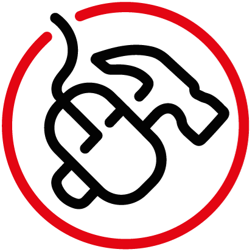

Vision/Mission Statement
=========================

`Carpentry@UiO <https://www.uio.no/english/for-employees/support/research/research-data/training/carpentry/>`_
is the UiO local relay of the international
`Carpentries <https://carpentries.org>`_ organisation.

We are a group of volunteers from the University of Oslo and beyond.
With support from the University of Oslo Library,
we offer to PhD students, researchers and others at UiO, and beyond:

- foundational coding and data science skills workshops from
  `Software Carpentry <http://software-carpentry.org/lessons>`_ and
  `Data Carpentry <http://datacarpentry.org/lessons>`_
- `Study Group events <https://uio-carpentry.github.io/studyGroup>`_
  dedicated to open and reproducible science, knowledge sharing,
  re-enforcing learning or discussing new subjects for
  future workshops/lesson development
- educational development and networking opportunities with the possibility
  to become Certified Carpentries Instructor
  and/or Carpentries Instructor Trainer

Our activities and community are open to any member of the UiO community
including staff, faculty, and students, paid, and volunteer.
We believe the Carpentries’ teaching methods are efficient
and can speed up take-up toward the adoption of Open Science at UiO.

Check out the `Carpentry@UiO Charter <charter.rst>`_.

Who are we?
=============

Carpentry\@UiO board (when elected)
-----------------------------------
- Anne Schad Bergsaker, USIT
- Tobias Busch, UV
- Viviane Girardin, NIVA
- Lex Nederbragt, IBV
- Annika Rockenberger, UB
- Naoe Tatara, UB
Carpentry\@UiO instructors
--------------------------

TODO

- Give a list of Carpentries instructors in Norway :
- can be taken from
  https://github.com/carpentries/carpentries.org/blob/gh-pages/_data/publish_instructors.csv
  does not differentiate Oslo from other cities (NORWAY only)

Here we should make sure we acknowledge member participation one way or another.

What do we do?
=============

Our primary activity is organizing and teaching hands-on foundational coding
and data science skills workshops using the materials and practices
of the Data and Software Carpentry organizations.
The club will also provide educational development and networking opportunities
for instructors.
To maintain transparency, board meeting notes, workshop schedules,
and all other club activities will be posted publicly on the web
(when possible) at the Carpentries\@UiO website.

Code of conduct
=================

We follow the `Carpentries’ Code of Conduct <https://docs.carpentries.org/topic_folders/policies/code-of-conduct.html>`_
to provide an inclusive and supportive environment for our learners
and our members. Any violation of our Code of Conduct should
be reported, it will then be handled as quickly as possible
and will remain confidential:

- to report Code of Conduct violations for official Carpentries workshops,
  see the Carpentries `Code of Conduct Incident Reporting Guidelines <https://docs.carpentries.org/topic_folders/policies/incident-reporting.html>`_
- to report Code of Conduct violations for local Carpentry\@UiO workshops,
  use UiO’s
  `speak-up <https://www.uio.no/english/about/hse/speak-up/index.html>`_ (English)
  or `si-fra <https://www.uio.no/om/hms/si-fra/>`_ (Norwegian) reporting

If the workshop is a local workshop
rather than an official Carpentries workshop,
the workshop website will have the Carpentry\@UiO logo:

Contributing
=============

Carpentry\@UiO is open to anyone interested in teaching foundational coding
and data science skills outside of the
traditional UiO curriculum.
All our members abide to the Carpentry\@UiO code of conduct.
